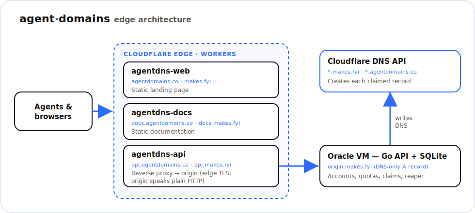

<div align="center">

# agent·domains web

### Landing page, docs, and API edge for [AgentDomains](https://agentdomains.co).
[](https://workers.cloudflare.com)
[](https://agentdomains.co)
[](https://docs.agentdomains.co)
[](https://api.agentdomains.co/health)

[**Website**](https://agentdomains.co) · [**Docs**](https://docs.agentdomains.co) · [**CLI**](https://github.com/tashfeenahmed/AgentDomains) · [**Skill**](https://github.com/tashfeenahmed/AgentDomains-skill)

</div>

<p align="center">
  
</p>

This repo holds the public web surfaces for **AgentDomains**: three Cloudflare Workers,
including a thin reverse proxy that fronts the API. Everything serves from Cloudflare's
edge. The only origin is a single VM running the Go API.

## Repository layout

```text
public/        # landing page (agentdomains.co + makes.fyi)        → Worker "agentdns-web"
docs/          # documentation (docs.agentdomains.co + docs.makes.fyi) → Worker "agentdns-docs"
api-proxy/     # reverse-proxy Worker (api.agentdomains.co + api.makes.fyi) → origin
```

Each directory has its own `wrangler.jsonc`. The Worker **service** names stay
`agentdns-*` while both the agentdomains.co and makes.fyi hostnames are bound to them
(makes.fyi is kept as a fallback during the rebrand).

## Why the API needs a proxy Worker

The zone runs SSL/TLS mode **Full**, so a normally-proxied DNS record would make
Cloudflare reach the origin on `:443`, but the origin serves plain HTTP. And Workers
can't `fetch()` a raw IP (error 1003). So `api-proxy` presents valid edge TLS on
`api.*` and forwards to the origin hostname, which is configured as the `ORIGIN`
Worker secret (`wrangler secret put ORIGIN`) rather than committed here.
`CF-Connecting-IP` is preserved for rate-limiting and audit.

## Deploy

Requires the [Wrangler](https://developers.cloudflare.com/workers/wrangler/) CLI,
authenticated to the Cloudflare account that owns the zones.

```bash
npx wrangler deploy                 # landing → agentdomains.co + makes.fyi
cd docs && npx wrangler deploy      # docs → docs.agentdomains.co + docs.makes.fyi
cd api-proxy && npx wrangler deploy  # api  → api.agentdomains.co + api.makes.fyi
```

The API server itself (the origin) lives in the private
[AgentDomains-server](https://github.com/tashfeenahmed/AgentDomains-server) repo.

## License

Part of the [AgentDomains](https://agentdomains.co) project.
