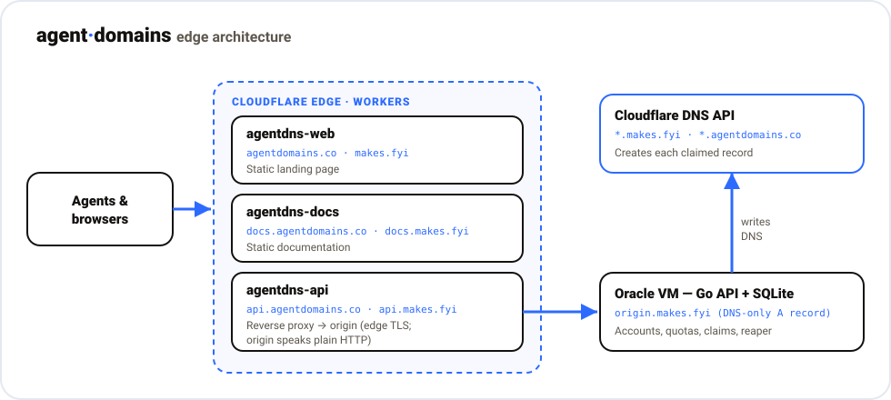

<div align="center">

# agent·domains web

### Landing page, docs, and API edge for [AgentDomains](https://agentdomains.co).
[](https://workers.cloudflare.com)
[](https://agentdomains.co)
[](https://docs.agentdomains.co)
[](https://api.agentdomains.co/health)

[**Website**](https://agentdomains.co) · [**Docs**](https://docs.agentdomains.co) · [**CLI**](https://github.com/tashfeenahmed/AgentDomains) · [**Skill**](https://github.com/tashfeenahmed/AgentDomains-skill)

</div>

<p align="center">
  
</p>

This repo holds the public web surfaces for **AgentDomains**: six Cloudflare Workers,
including a thin reverse proxy that fronts the API. Everything serves from Cloudflare's
edge. The only origin is a single VM running the Go API.

## Repository layout

```text
public/        # landing page (agentdomains.co + makes.fyi)            → Worker "agentdns-web"
docs/          # documentation (docs.agentdomains.co + docs.makes.fyi) → Worker "agentdns-docs"
api-proxy/     # reverse-proxy Worker (api.agentdomains.co + api.makes.fyi) → origin
mcp/           # hosted MCP endpoint (mcp.agentdomains.co + mcp.makes.fyi)
forward/       # URL-forwarding Worker — no routes of its own (see below)
proxy/         # reverse-proxy Worker for customer names — no routes of its own
```

Each directory has its own `wrangler.jsonc`. The Worker **service** names stay
`agentdns-*` while both the agentdomains.co and makes.fyi hostnames are bound to them
(makes.fyi is kept as a fallback during the rebrand).

### The two Workers with no routes

`forward/` and `proxy/` are deployed like any other Worker but deliberately declare
**no routes**. A wildcard route such as `*.makes.fyi/*` would shadow the `api.` and
`docs.` custom-domain Workers and the apex landing page — that exact mistake once took
api and docs down. Instead the API server calls
`POST /zones/{zone}/workers/routes` to bind a single hostname
(`<label>.<domain>/*` → `agentdns-forward` or `agentdns-proxy`) the moment a forward or
a reverse proxy is created, and deletes that route when it is torn down. So each Worker
only ever runs for hostnames that genuinely are forwards or proxies.

Two consequences worth knowing:

- **The script names are a contract.** The server looks them up by name
  (`AGENTDOMAINS_FORWARD_WORKER`, default `agentdns-forward`;
  `AGENTDOMAINS_PROXY_WORKER`, default `agentdns-proxy`). Renaming a Worker here without
  changing those env vars breaks forwarding at runtime, not at deploy time.
- **The server's Cloudflare token needs Workers Routes, not just DNS.** Creating a route
  is a different permission from writing a DNS record. A token with only
  *Zone → DNS → Edit* answers `403 code 10000 "Authentication error"` on the route call,
  and the whole request fails — even though the DNS half worked. The token must carry
  **Zone → Workers Routes → Edit** on every zone in `AGENTDOMAINS_DOMAINS`, alongside
  *Zone → DNS → Edit* and *Zone → Zone → Read*.

## Why the API needs a proxy Worker

The zone runs SSL/TLS mode **Full**, so a normally-proxied DNS record would make
Cloudflare reach the origin on `:443`, but the origin serves plain HTTP. And Workers
can't `fetch()` a raw IP (error 1003). So `api-proxy` presents valid edge TLS on
`api.*` and forwards to the origin hostname, which is configured as the `ORIGIN`
Worker secret (`wrangler secret put ORIGIN`) rather than committed here.
`CF-Connecting-IP` is preserved for rate-limiting and audit.

## Deploy

Requires the [Wrangler](https://developers.cloudflare.com/workers/wrangler/) CLI,
authenticated to the Cloudflare account that owns the zones.

Deploy all six from the repo root:

```bash
npx wrangler deploy                    # landing  → agentdomains.co + makes.fyi
(cd docs      && npx wrangler deploy)  # docs     → docs.agentdomains.co + docs.makes.fyi
(cd api-proxy && npx wrangler deploy)  # api      → api.agentdomains.co + api.makes.fyi
(cd mcp       && npx wrangler deploy)  # mcp      → mcp.agentdomains.co + mcp.makes.fyi
(cd forward   && npx wrangler deploy)  # forwards → no routes; the API server binds them
(cd proxy     && npx wrangler deploy)  # proxies  → no routes; the API server binds them
```

`forward` and `proxy` print **"No targets deployed"**. That is expected and correct —
they have no routes by design (see above), and the script is uploaded regardless. Skipping
these two is easy to do and hard to notice: every endpoint keeps working except
`PUT /v1/subdomains/{label}/forward` and `/proxy`, which fail once the API server tries
to bind a route to a script that is not there.

`api-proxy` needs its origin set once, as a secret rather than in the repo:

```bash
(cd api-proxy && npx wrangler secret put ORIGIN)   # e.g. http://origin.example
```

### Never answer with a bare 502 from the origin

Cloudflare replaces an origin `502` with its own branded HTML error page. The body the
origin sent is discarded, so a caller gets a wall of HTML where a one-sentence JSON error
used to be — and an agent has nothing to act on. This is not hypothetical: forwarding was
broken for a while behind exactly that page, and the actual cause (a `403` on the Worker
route call) was only visible by asking the origin directly, bypassing the edge:

```bash
curl -X PUT http://<origin-host>/v1/subdomains/<label>/forward \
  -H "Authorization: Bearer $AGENTDOMAINS_API_KEY" \
  -H 'Content-Type: application/json' -d '{"target":"https://example.com"}'
```

The API server now answers upstream failures with `503` and a JSON body
(`{"error": …, "retry": true, "upstream": "cloudflare"}`), which passes through the edge
untouched. Keep it that way: any status the origin returns is fine except `502`.

The API server itself (the origin) lives in the private
[AgentDomains-server](https://github.com/tashfeenahmed/AgentDomains-server) repo.

## License

Part of the [AgentDomains](https://agentdomains.co) project.
